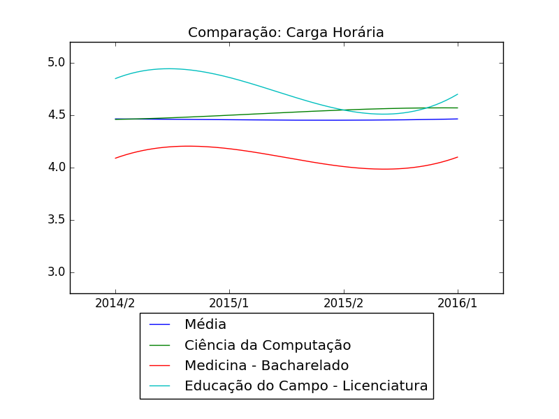
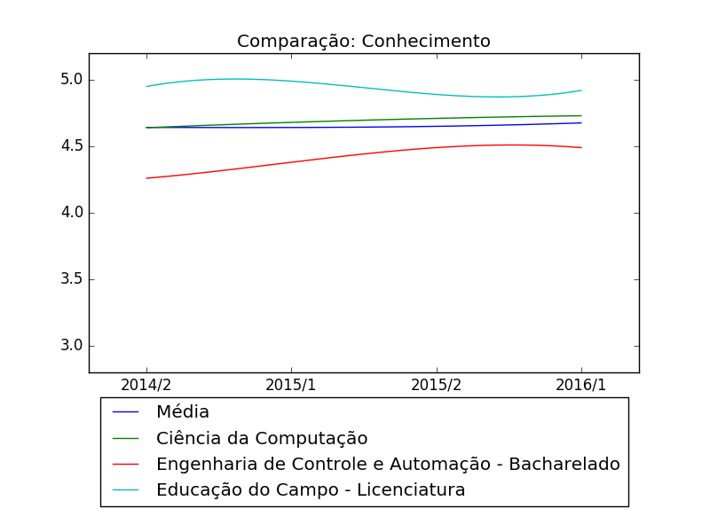
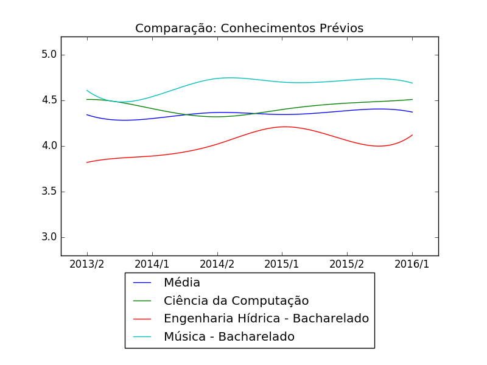
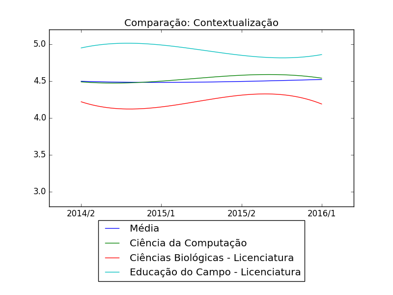
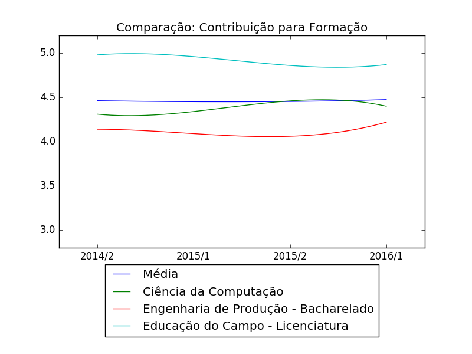
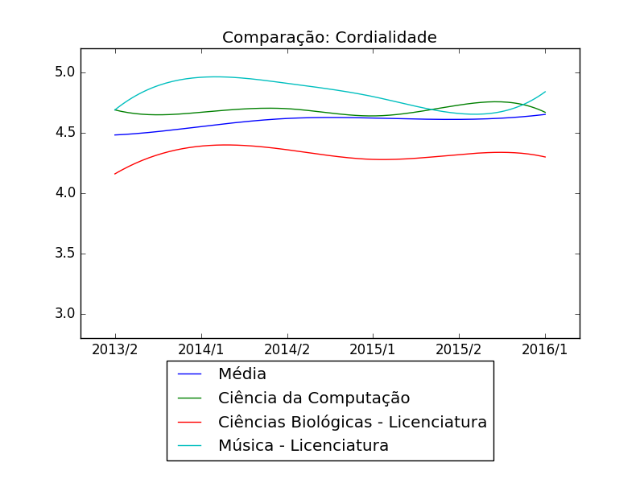
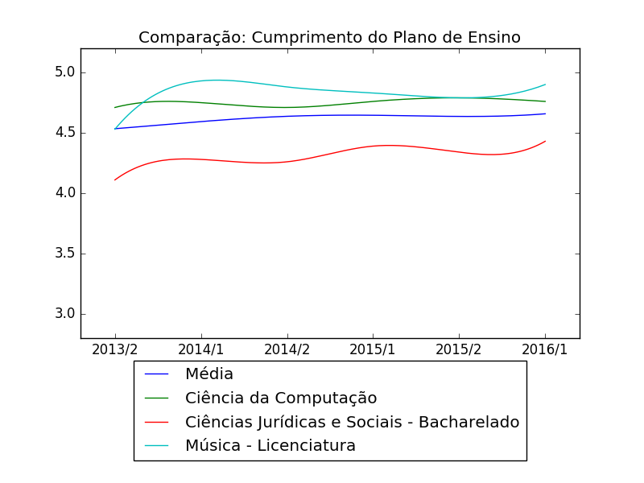
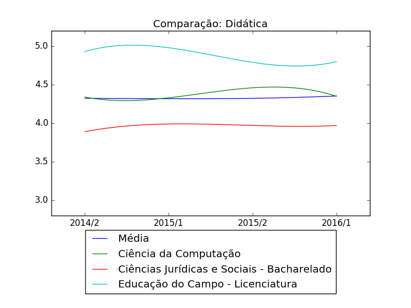
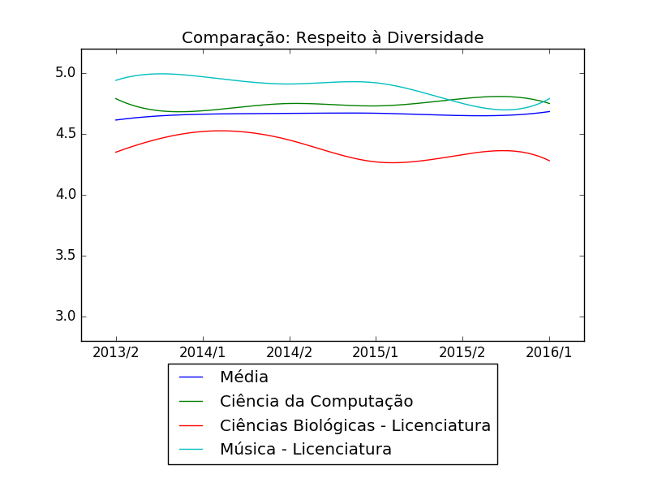
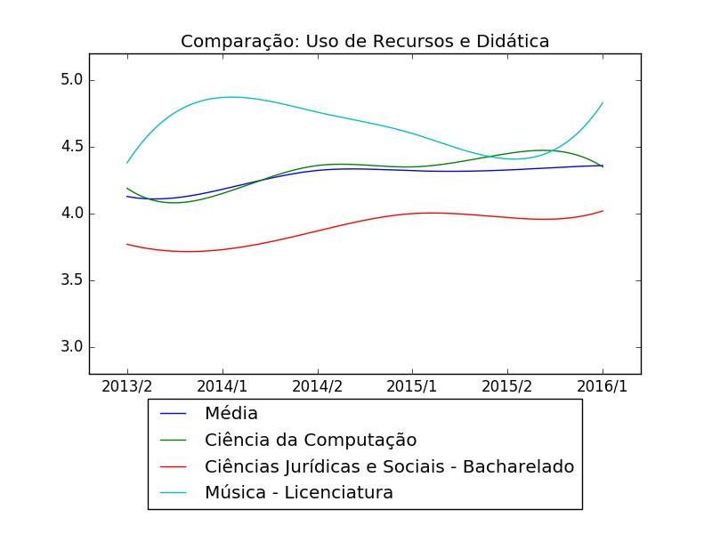

# UFRGS Evaluation Aggregator
This project aims to aggregate all the scattered numbers the Federal University of Rio Grande do Sul provides about the student evaluation of their courses into human-friendly graphs.

